# [📈 Live Status](https://upptime.github.io/upptime): <!--live status--> **🟧 Partial outage**

This repository contains the open-source uptime monitor and status page for [Upptime](https://upptime.js.org), powered by [Upptime](https://github.com/upptime/upptime).

With [Upptime](https://upptime.js.org), you can get your own unlimited and free uptime monitor and status page, powered entirely by a GitHub repository. We use [Issues](https://github.com/upptime/upptime/issues) as incident reports, [Actions](https://github.com/9renpoto/upptime/actions) as uptime monitors, and [Pages](https://upptime.github.io/upptime) for the status page.

<!--start: status pages-->
<!-- This summary is generated by Upptime (https://github.com/upptime/upptime) -->
<!-- Do not edit this manually, your changes will be overwritten -->
<!-- prettier-ignore -->
| URL | Status | History | Response Time | Uptime |
| --- | ------ | ------- | ------------- | ------ |
|  [blog](https://9renpoto.win/healthz) | 🟩 Up | [blog.yml](https://github.com/9renpoto/upptime/commits/HEAD/history/blog.yml) | 

 787ms
     
 | 

<a href="https://9renpoto.github.io/upptime/history/blog">100.00%</a>
    

|  [slides](https://slides.9renpoto.win) | 🟩 Up | [slides.yml](https://github.com/9renpoto/upptime/commits/HEAD/history/slides.yml) | 

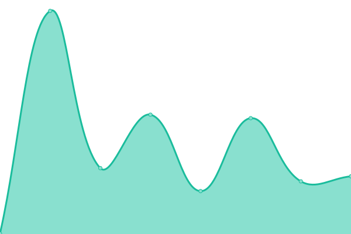 278ms
     
 | 

<a href="https://9renpoto.github.io/upptime/history/slides">100.00%</a>
    

|  [github](https://github.com/9renpoto) | 🟩 Up | [github.yml](https://github.com/9renpoto/upptime/commits/HEAD/history/github.yml) | 

 444ms
     
 | 

<a href="https://9renpoto.github.io/upptime/history/github">100.00%</a>
    

|  [npm](https://www.npmjs.com/~9renpoto) | 🟩 Up | [npm.yml](https://github.com/9renpoto/upptime/commits/HEAD/history/npm.yml) | 

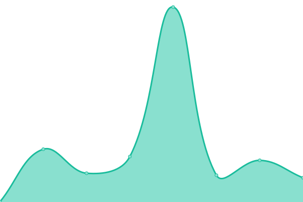 400ms
     
 | 

<a href="https://9renpoto.github.io/upptime/history/npm">100.00%</a>
    

|  [wakatime](https://wakatime.com/@9renpoto) | 🟩 Up | [wakatime.yml](https://github.com/9renpoto/upptime/commits/HEAD/history/wakatime.yml) | 

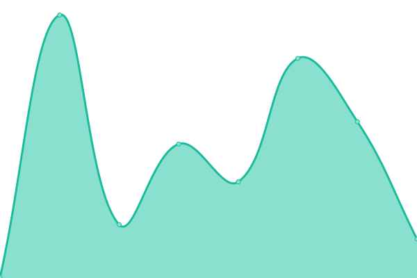 437ms
     
 | 

<a href="https://9renpoto.github.io/upptime/history/wakatime">99.78%</a>
    

|  [coderank](https://profile.codersrank.io/user/9renpoto/) | 🟩 Up | [coderank.yml](https://github.com/9renpoto/upptime/commits/HEAD/history/coderank.yml) | 

 1014ms
     
 | 

<a href="https://9renpoto.github.io/upptime/history/coderank">100.00%</a>
    

|  [lapras](https://lapras.com/public/PY86OSF) | 🟩 Up | [lapras.yml](https://github.com/9renpoto/upptime/commits/HEAD/history/lapras.yml) | 

 625ms
     
 | 

<a href="https://9renpoto.github.io/upptime/history/lapras">99.35%</a>
    

|  [forkwell](https://portfolio.forkwell.com/@9renpoto) | 🟥 Down | [forkwell.yml](https://github.com/9renpoto/upptime/commits/HEAD/history/forkwell.yml) | 

 576ms
     
 | 

<a href="https://9renpoto.github.io/upptime/history/forkwell">0.00%</a>
    

|  [youtrust](https://youtrust.jp/users/9renpoto) | 🟩 Up | [youtrust.yml](https://github.com/9renpoto/upptime/commits/HEAD/history/youtrust.yml) | 

 2327ms
     
 | 

<a href="https://9renpoto.github.io/upptime/history/youtrust">100.00%</a>
    

|  [wantedly](https://www.wantedly.com/id/keisuke_umeno) | 🟩 Up | [wantedly.yml](https://github.com/9renpoto/upptime/commits/HEAD/history/wantedly.yml) | 

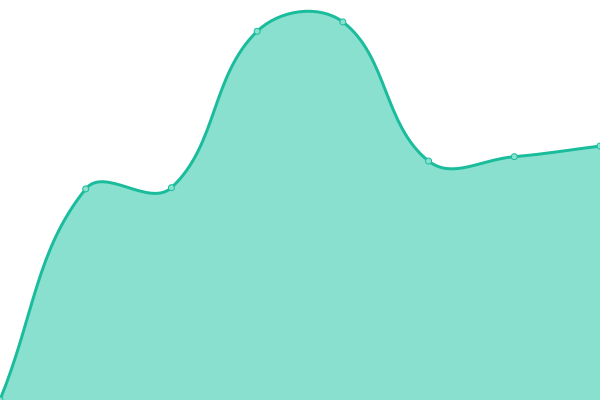 1463ms
     
 | 

<a href="https://9renpoto.github.io/upptime/history/wantedly">100.00%</a>
    

|  [gitlab](https://gitlab.com/9renpoto) | 🟩 Up | [gitlab.yml](https://github.com/9renpoto/upptime/commits/HEAD/history/gitlab.yml) | 

 296ms
     
 | 

<a href="https://9renpoto.github.io/upptime/history/gitlab">100.00%</a>
    

|  [dev.to](https://dev.to/9renpoto) | 🟩 Up | [dev-to.yml](https://github.com/9renpoto/upptime/commits/HEAD/history/dev-to.yml) | 

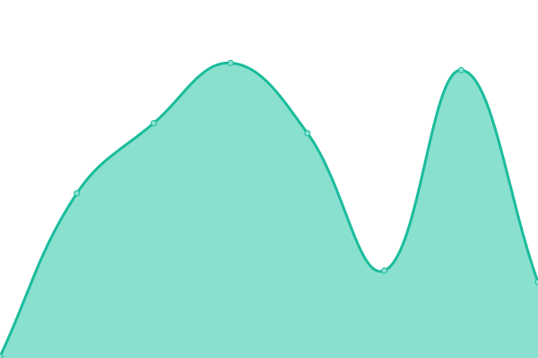 184ms
     
 | 

<a href="https://9renpoto.github.io/upptime/history/dev-to">100.00%</a>
    

|  [yamap](https://yamap.com/users/2121389) | 🟩 Up | [yamap.yml](https://github.com/9renpoto/upptime/commits/HEAD/history/yamap.yml) | 

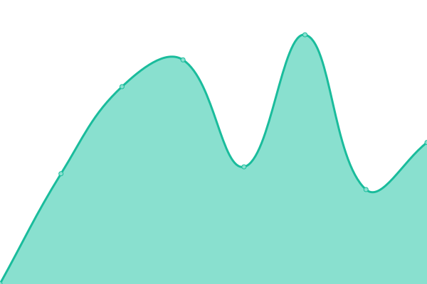 979ms
     
 | 

<a href="https://9renpoto.github.io/upptime/history/yamap">100.00%</a>
    

|  [bluesky](https://bsky.app/profile/9renpoto.win) | 🟩 Up | [bluesky.yml](https://github.com/9renpoto/upptime/commits/HEAD/history/bluesky.yml) | 

 249ms
     
 | 

<a href="https://9renpoto.github.io/upptime/history/bluesky">100.00%</a>
    

|  [facebook](https://www.facebook.com/9renpoto) | 🟩 Up | [facebook.yml](https://github.com/9renpoto/upptime/commits/HEAD/history/facebook.yml) | 

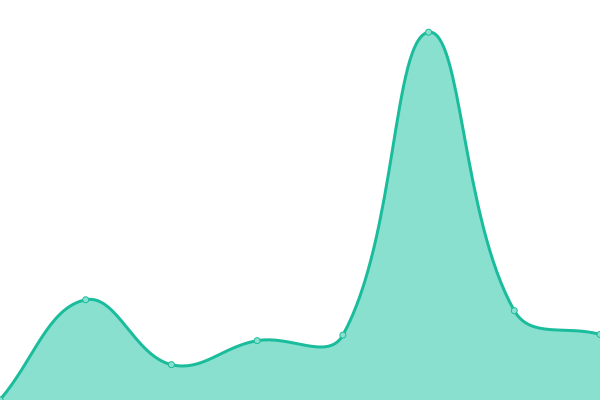 709ms
     
 | 

<a href="https://9renpoto.github.io/upptime/history/facebook">100.00%</a>
    

|  [threads](https://www.threads.net/@9renpoto) | 🟩 Up | [threads.yml](https://github.com/9renpoto/upptime/commits/HEAD/history/threads.yml) | 

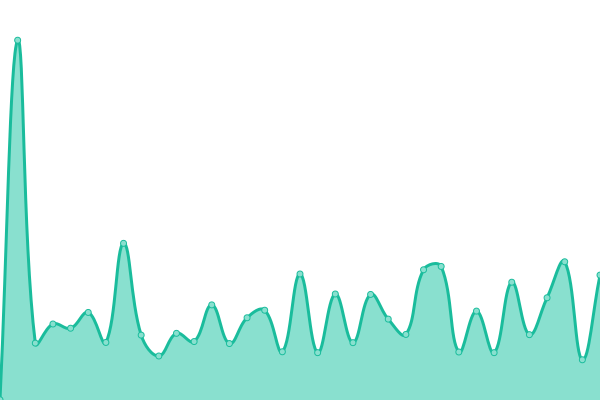 865ms
     
 | 

<a href="https://9renpoto.github.io/upptime/history/threads">82.18%</a>
    

|  [pinterest](https://www.pinterest.jp/9renpoto/) | 🟩 Up | [pinterest.yml](https://github.com/9renpoto/upptime/commits/HEAD/history/pinterest.yml) | 

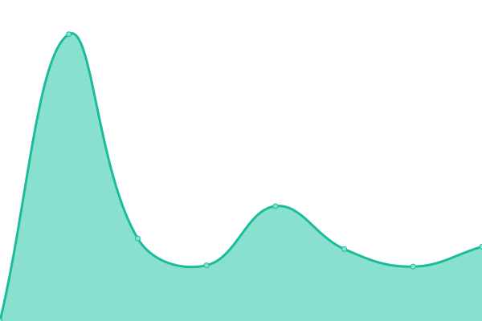 1189ms
     
 | 

<a href="https://9renpoto.github.io/upptime/history/pinterest">100.00%</a>
    

|  [instagram](https://www.instagram.com/9renpoto/) | 🟥 Down | [instagram.yml](https://github.com/9renpoto/upptime/commits/HEAD/history/instagram.yml) | 

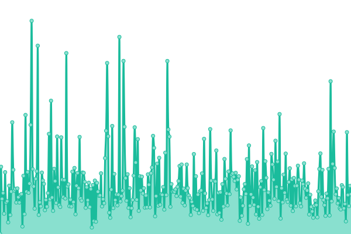 693ms
     
 | 

<a href="https://9renpoto.github.io/upptime/history/instagram">80.56%</a>
    

|  [tumber](https://www.tumblr.com/9renpoto) | 🟩 Up | [tumber.yml](https://github.com/9renpoto/upptime/commits/HEAD/history/tumber.yml) | 

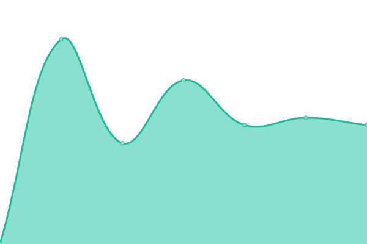 930ms
     
 | 

<a href="https://9renpoto.github.io/upptime/history/tumber">100.00%</a>
    

<!--end: status pages-->

[**Visit our status website →**](https://upptime.github.io/upptime)

## 📄 License

- Powered by: [Upptime](https://github.com/upptime/upptime)
- Code: [MIT](./LICENSE) © [Upptime](https://upptime.js.org)
- Data in the `./history` directory: [Open Database License](https://opendatacommons.org/licenses/odbl/1-0/)
