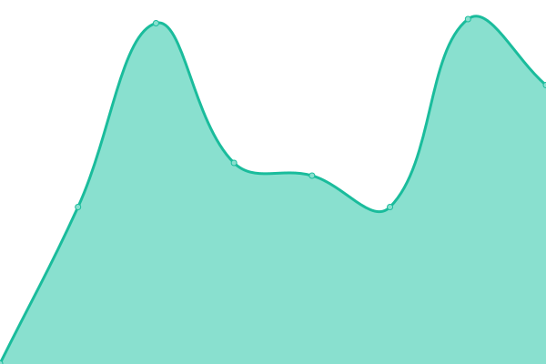
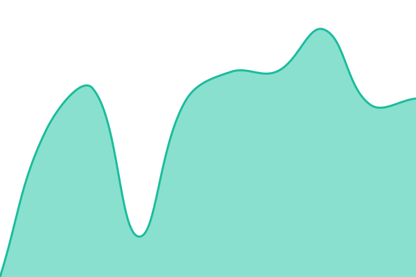
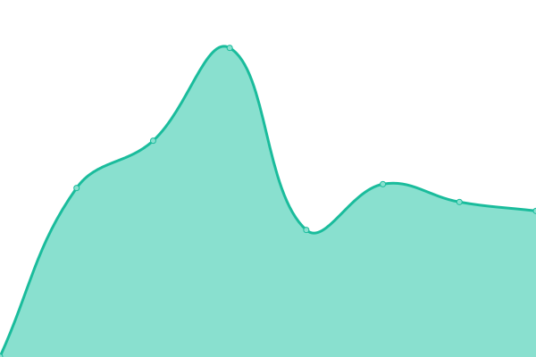
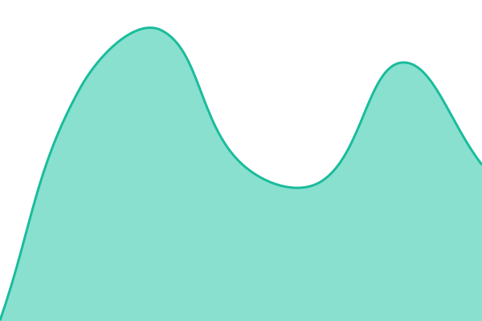
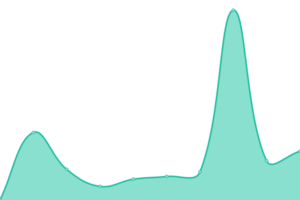

# [📈 Live Status](https://upptime.github.io/upptime): <!--live status--> **🟧 Partial outage**

This repository contains the open-source uptime monitor and status page for [Upptime](https://upptime.js.org), powered by [Upptime](https://github.com/upptime/upptime).

With [Upptime](https://upptime.js.org), you can get your own unlimited and free uptime monitor and status page, powered entirely by a GitHub repository. We use [Issues](https://github.com/upptime/upptime/issues) as incident reports, [Actions](https://github.com/9renpoto/upptime/actions) as uptime monitors, and [Pages](https://upptime.github.io/upptime) for the status page.

<!--start: status pages-->
<!-- This summary is generated by Upptime (https://github.com/upptime/upptime) -->
<!-- Do not edit this manually, your changes will be overwritten -->
<!-- prettier-ignore -->
| URL | Status | History | Response Time | Uptime |
| --- | ------ | ------- | ------------- | ------ |
|  [blog](https://9renpoto.win/healthz) | 🟩 Up | [blog.yml](https://github.com/9renpoto/upptime/commits/HEAD/history/blog.yml) | 

 760ms
     
 | 

<a href="https://9renpoto.github.io/upptime/history/blog">100.00%</a>
    

|  [slides](https://slides.9renpoto.win) | 🟩 Up | [slides.yml](https://github.com/9renpoto/upptime/commits/HEAD/history/slides.yml) | 

 262ms
     
 | 

<a href="https://9renpoto.github.io/upptime/history/slides">100.00%</a>
    

|  [github](https://github.com/9renpoto) | 🟩 Up | [github.yml](https://github.com/9renpoto/upptime/commits/HEAD/history/github.yml) | 

 593ms
     
 | 

<a href="https://9renpoto.github.io/upptime/history/github">100.00%</a>
    

|  [wakatime](https://wakatime.com/@9renpoto) | 🟩 Up | [wakatime.yml](https://github.com/9renpoto/upptime/commits/HEAD/history/wakatime.yml) | 

 298ms
     
 | 

<a href="https://9renpoto.github.io/upptime/history/wakatime">100.00%</a>
    

|  [wantedly](https://www.wantedly.com/id/keisuke_umeno) | 🟩 Up | [wantedly.yml](https://github.com/9renpoto/upptime/commits/HEAD/history/wantedly.yml) | 

 1841ms
     
 | 

<a href="https://9renpoto.github.io/upptime/history/wantedly">100.00%</a>
    

|  [gitlab](https://gitlab.com/9renpoto) | 🟩 Up | [gitlab.yml](https://github.com/9renpoto/upptime/commits/HEAD/history/gitlab.yml) | 

 265ms
     
 | 

<a href="https://9renpoto.github.io/upptime/history/gitlab">100.00%</a>
    

|  [yamap](https://yamap.com/users/2121389) | 🟩 Up | [yamap.yml](https://github.com/9renpoto/upptime/commits/HEAD/history/yamap.yml) | 

 667ms
     
 | 

<a href="https://9renpoto.github.io/upptime/history/yamap">100.00%</a>
    

|  [bluesky](https://bsky.app/profile/9renpoto.win) | 🟩 Up | [bluesky.yml](https://github.com/9renpoto/upptime/commits/HEAD/history/bluesky.yml) | 

 258ms
     
 | 

<a href="https://9renpoto.github.io/upptime/history/bluesky">100.00%</a>
    

|  [threads](https://www.threads.com/@9renpoto) | 🟥 Down | [threads.yml](https://github.com/9renpoto/upptime/commits/HEAD/history/threads.yml) | 

 352ms
     
 | 

<a href="https://9renpoto.github.io/upptime/history/threads">94.52%</a>
    

<!--end: status pages-->

[**Visit our status website →**](https://upptime.github.io/upptime)

## 📄 License

- Powered by: [Upptime](https://github.com/upptime/upptime)
- Code: [MIT](./LICENSE) © [Upptime](https://upptime.js.org)
- Data in the `./history` directory: [Open Database License](https://opendatacommons.org/licenses/odbl/1-0/)
