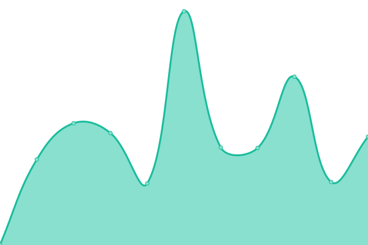
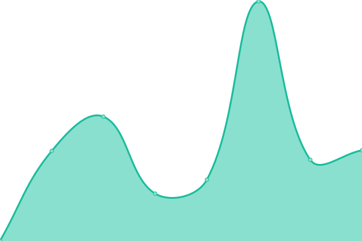

# [📈 Live Status](https://upptime.github.io/upptime): <!--live status--> **🟩 All systems operational**

This repository contains the open-source uptime monitor and status page for [Upptime](https://upptime.js.org), powered by [Upptime](https://github.com/upptime/upptime).

With [Upptime](https://upptime.js.org), you can get your own unlimited and free uptime monitor and status page, powered entirely by a GitHub repository. We use [Issues](https://github.com/upptime/upptime/issues) as incident reports, [Actions](https://github.com/9renpoto/upptime/actions) as uptime monitors, and [Pages](https://upptime.github.io/upptime) for the status page.

<!--start: status pages-->
<!-- This summary is generated by Upptime (https://github.com/upptime/upptime) -->
<!-- Do not edit this manually, your changes will be overwritten -->
<!-- prettier-ignore -->
| URL | Status | History | Response Time | Uptime |
| --- | ------ | ------- | ------------- | ------ |
|  [twitter](https://twitter.com/9renpoto) | 🟩 Up | [twitter.yml](https://github.com/9renpoto/upptime/commits/HEAD/history/twitter.yml) | 

 2402ms
     
 | 

<a href="https://9renpoto.github.io/upptime/history/twitter">100.00%</a>
    

|  [facebook](https://www.facebook.com/9renpoto) | 🟩 Up | [facebook.yml](https://github.com/9renpoto/upptime/commits/HEAD/history/facebook.yml) | 

 289ms
     
 | 

<a href="https://9renpoto.github.io/upptime/history/facebook">100.00%</a>
    

|  [yamap](https://yamap.com/users/2121389) | 🟩 Up | [yamap.yml](https://github.com/9renpoto/upptime/commits/HEAD/history/yamap.yml) | 

 1628ms
     
 | 

<a href="https://9renpoto.github.io/upptime/history/yamap">100.00%</a>
    

|  [blog](https://9renpoto.dev) | 🟩 Up | [blog.yml](https://github.com/9renpoto/upptime/commits/HEAD/history/blog.yml) | 

 619ms
     
 | 

<a href="https://9renpoto.github.io/upptime/history/blog">100.00%</a>
    

|  [slides](https://slide.9renpoto.dev) | 🟩 Up | [slides.yml](https://github.com/9renpoto/upptime/commits/HEAD/history/slides.yml) | 

 128ms
     
 | 

<a href="https://9renpoto.github.io/upptime/history/slides">100.00%</a>
    

|  [github](https://github.com/9renpoto) | 🟩 Up | [github.yml](https://github.com/9renpoto/upptime/commits/HEAD/history/github.yml) | 

 1129ms
     
 | 

<a href="https://9renpoto.github.io/upptime/history/github">100.00%</a>
    

|  [gitlab](https://gitlab.com/9renpoto) | 🟩 Up | [gitlab.yml](https://github.com/9renpoto/upptime/commits/HEAD/history/gitlab.yml) | 

 287ms
     
 | 

<a href="https://9renpoto.github.io/upptime/history/gitlab">100.00%</a>
    

|  [dev.to](https://dev.to/9renpoto) | 🟩 Up | [dev-to.yml](https://github.com/9renpoto/upptime/commits/HEAD/history/dev-to.yml) | 

 139ms
     
 | 

<a href="https://9renpoto.github.io/upptime/history/dev-to">100.00%</a>
    

|  [wakatime](https://wakatime.com/@9renpoto) | 🟩 Up | [wakatime.yml](https://github.com/9renpoto/upptime/commits/HEAD/history/wakatime.yml) | 

 286ms
     
 | 

<a href="https://9renpoto.github.io/upptime/history/wakatime">100.00%</a>
    

|  [coderank](https://profile.codersrank.io/user/9renpoto/) | 🟩 Up | [coderank.yml](https://github.com/9renpoto/upptime/commits/HEAD/history/coderank.yml) | 

 1505ms
     
 | 

<a href="https://9renpoto.github.io/upptime/history/coderank">100.00%</a>
    

|  [npm](https://www.npmjs.com/~9renpoto) | 🟩 Up | [npm.yml](https://github.com/9renpoto/upptime/commits/HEAD/history/npm.yml) | 

 388ms
     
 | 

<a href="https://9renpoto.github.io/upptime/history/npm">100.00%</a>
    

|  [pinterest](https://www.pinterest.jp/9renpoto/) | 🟩 Up | [pinterest.yml](https://github.com/9renpoto/upptime/commits/HEAD/history/pinterest.yml) | 

 1063ms
     
 | 

<a href="https://9renpoto.github.io/upptime/history/pinterest">100.00%</a>
    

<!--end: status pages-->

[**Visit our status website →**](https://upptime.github.io/upptime)

## 📄 License

- Powered by: [Upptime](https://github.com/upptime/upptime)
- Code: [MIT](./LICENSE) © [Upptime](https://upptime.js.org)
- Data in the `./history` directory: [Open Database License](https://opendatacommons.org/licenses/odbl/1-0/)
